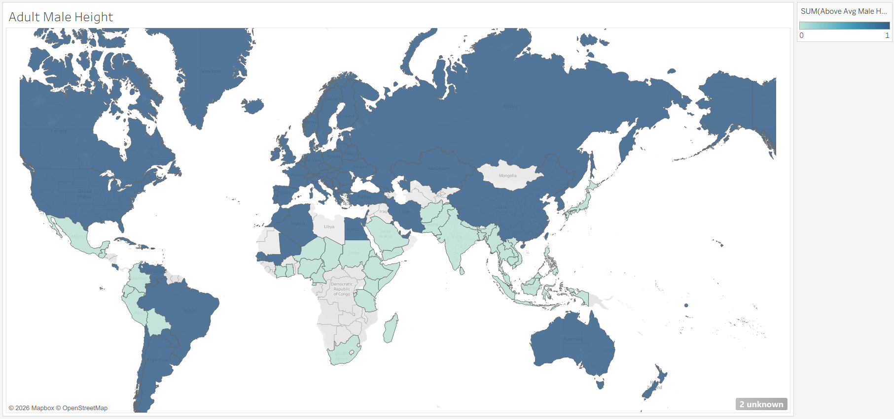

# Data Visualization as Storytelling

## Overview
This project explores three different datasets through interactive Tableau visualizations, demonstrating how data visualization can be used to communicate patterns and trends across different subject areas.

The project examines global differences in average adult height, historical trends in music sales by format, and video game sales across different platforms and genres.

The project was completed in Tableau as part of the Global Career Accelerator Data Analytics program.

## Business Questions
This project explores three separate questions:
- How does average adult height vary across countries?
- How have music sales changed across different formats over time?
- Which video game platforms and genres have generated the highest sales?

## Data
The project contains three datasets:
### 1. Average Adult Height by Country
This dataset contains average male and female adult height measurements by country.

Key variables include:
- Country
- Average male adult height
- Average female adult height

### 2. Historical Music Sales
This dataset contains music sales data categorized by format and year.

The analysis examines changes in music sales across different formats over time.

### 3. Video Game Sales
This dataset contains video game sales information across different platforms and genres.

The analysis compares sales across:
- Video game platforms
- Genres
- Release years

## Analysis
### Global Average Adult Height
I created Tableau visualizations to compare average adult height across countries.

Key analysis included:
- Creating geographic visualizations of average female adult height
- Comparing average male and female adult height across countries
- Using a choropleth map to visualize geographic differences
- Exploring global patterns in average adult height

### Historical Music Sales
I analyzed historical music sales to examine how consumer purchasing behavior changed across different music formats.

Key analysis included:
- Comparing music sales across formats
- Examining sales trends over time
- Visualizing changes in the popularity of different formats
- Identifying shifts in music consumption patterns

### Video Game Sales
I analyzed video game sales to compare performance across platforms and genres.

Key analysis included:
- Comparing total sales across video game platforms
- Examining sales by genre
- Identifying the highest-selling platforms and genres
- Using visualizations to compare video game market performance

## Key Findings
### Global Average Adult Height
The geographic visualizations show substantial variation in average adult height across countries. Comparing male and female averages also highlights differences in height patterns between the two groups.

### Historical Music Sales
Music sales changed substantially over time as different formats gained and lost popularity. The visualization highlights shifts in the dominant formats across the historical period represented in the dataset.

### Video Game Sales
Video game sales vary considerably across platforms and genres. The analysis highlights differences in market performance and makes it possible to identify the platforms and genres associated with higher total sales.

## Visualizations

## Interactive Dashboard
[View the interactive visualizations on Tableau Public](https://public.tableau.com/views/LevelUpMilestone-DataVisualizationasStorytelling--AnanyaGarg/WriteAnswersHere?:language=en-US&:sid=&:redirect=auth&:display_count=n&:origin=viz_share_link)

## Tools & Skills
- Tableau
- Data visualization
- Geographic visualization
- Choropleth maps
- Time-series analysis
- Comparative analysis
- Data aggregation
- Interactive visualizations
- Categorical analysis
- Data storytelling

## Project Context
This project was completed as part of the Global Career Accelerator Data Analytics program. The project demonstrates how different visualization techniques can be used to communicate insights from geographic, historical, and market datasets.
